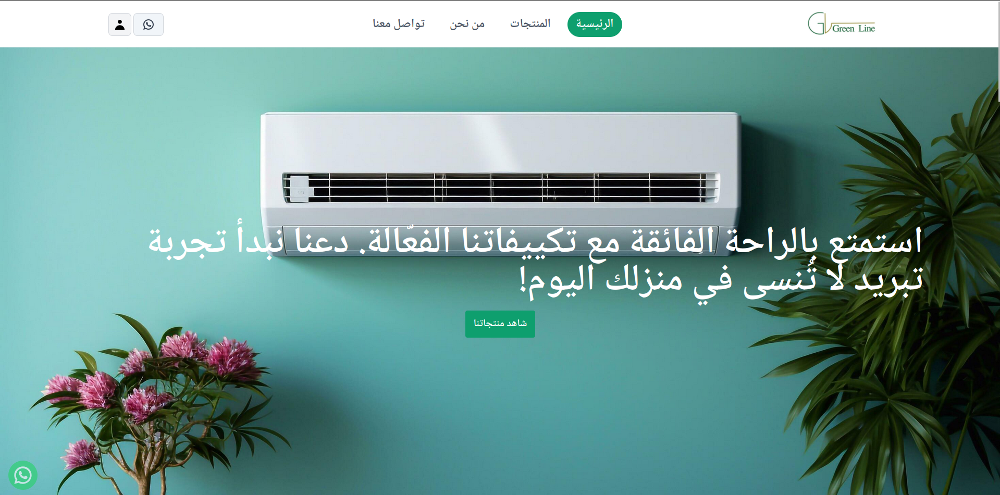
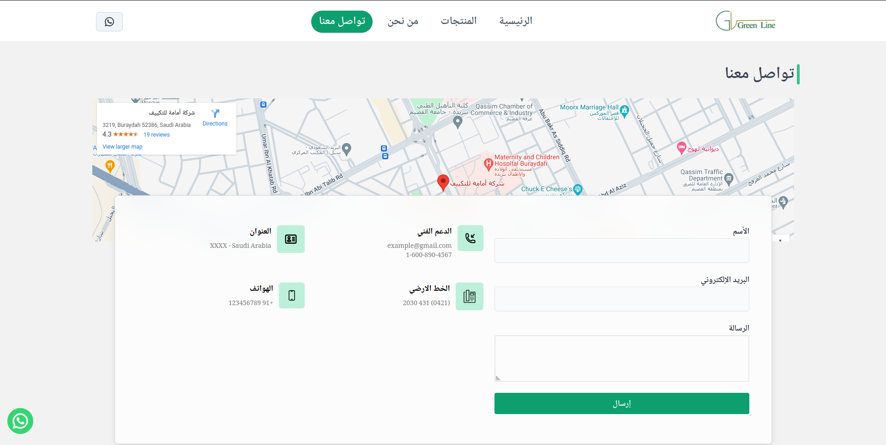
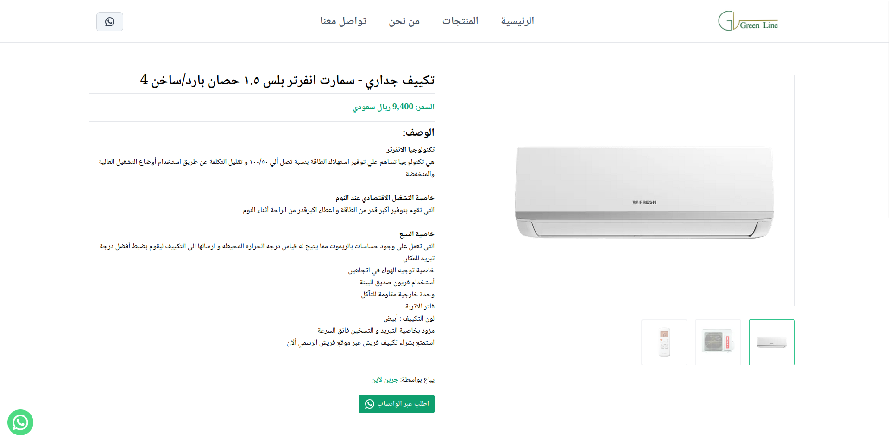
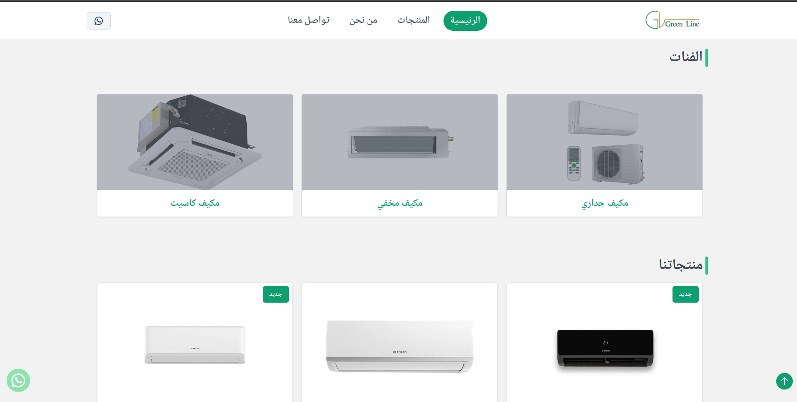
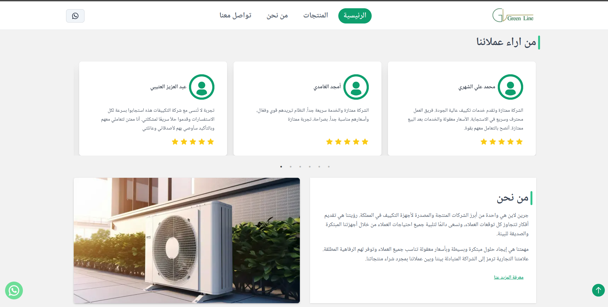
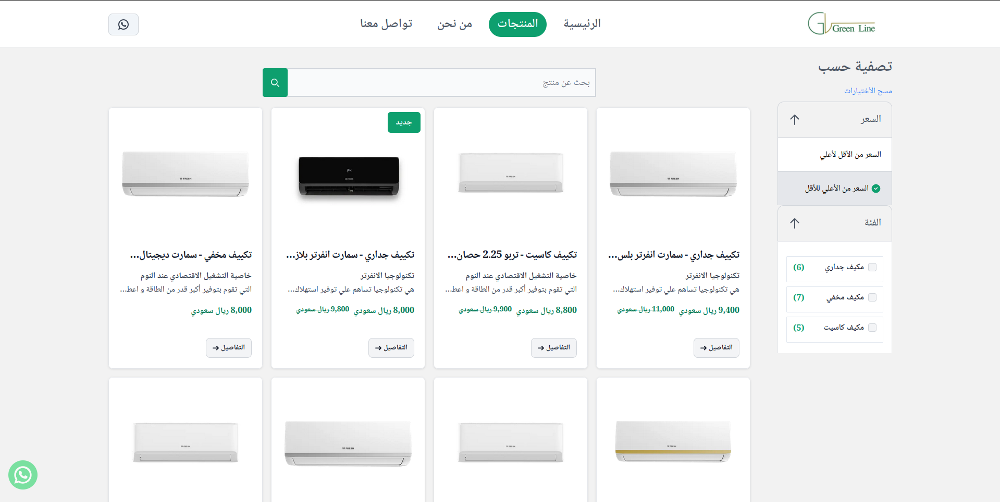
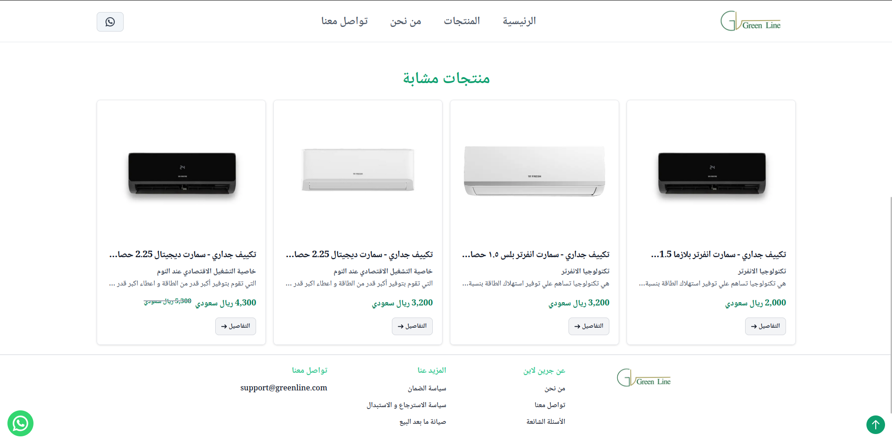
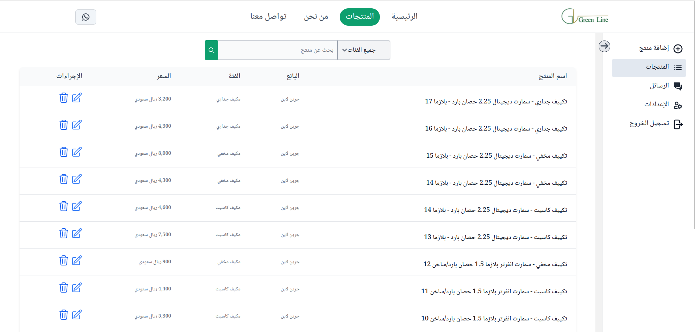
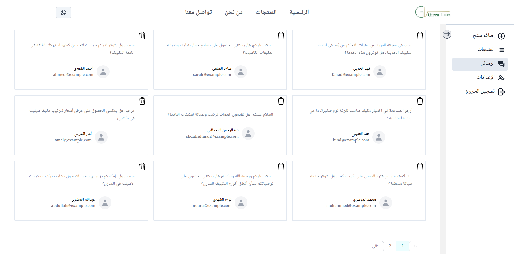
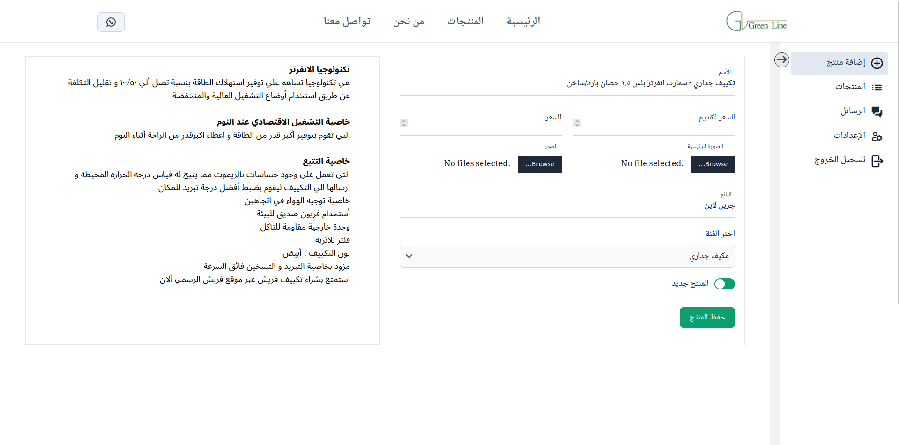

# GreenLine.net

- Green line is one of the leading air conditioning producers and exporters in the saudi arabia.

- Our vision is to provide ideas that exceed all customer expectations, and we always strive for all essential customers with our innovative and environmentally friendly machines.

- It's created and developed using `Next.js` for both frontend and backend, with `MongoDB`integration, styled with `Tailwind CSS`, and built with `TypeScript`.

## Technologies Used

- **Frontend**: **_Next.js_** for enabling seamless client-side and server-side rendering.
- **Backend**: **_Next.js API Routes_** powered by **_Node.js_**.
- **Database**: **_MongoDB_** , managed through **_Mongoose_** .

---

